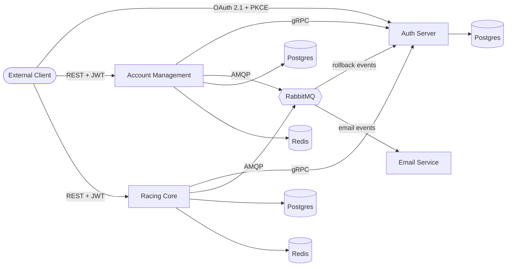

# Mobility App

A production-grade demo platform built as **4 microservices** around an
**OAuth 2.1 + OIDC authorization server**, using **gRPC** and **REST** for internal
service-to-service calls, **RabbitMQ** for async workflows, and the
**orchistration saga pattern** with compensating transactions for distributed rollbacks
across service boundaries.

**Built with Java 21 · Spring Boot 3.5 · Spring Authorization Server · Go · PostgreSQL · Redis · RabbitMQ**

> **Status:** Fully functional portfolio project. `docker compose up` brings up
> the entire platform locally. See [NOTICE.md](./NOTICE.md) for usage terms.

## Architecture at a glance



## Services

| Service | Role | Repository |
|---|---|---|
| **auth-server** | OAuth 2.1 + OIDC authorization server. Issues JWTs, manages users, roles, and OAuth clients. It is a gRPC server for internal calls and RabbitMQ listener for saga compensations. | [→](https://github.com/mobility-systems/auth-server) |
| **account-management** | User and organization registration, account confirmation flow. The orchistration saga pattern is used for some of the processes e.g. user registration, to ensure data integrity across the auth server and the account management. Also for the email confirmation process a hybrid JWT token is used so it leverages both the stateless and the stateful states advantages. | [→](https://github.com/mobility-systems/account-management) |
| **racing-core** | Domain service for cars, drivers, laps, tracks.  The orchistration saga pattern is used for some of the processes e.g. driver registration, to ensure data integrity to the auth server. | [→](https://github.com/mobility-systems/racing-core) |
| **email-service** | Go service. RabbitMQ consumer that sends transactional emails (confirmation tokens, notifications) via Resend. | [→](https://github.com/mobility-systems/email-service) |
| **mobility-common** | Shared Maven library: gRPC protos, RabbitMQ queue definitions, saga orchestrator, common exceptions, DTOs, Util classes e.g. ULID generator. | [→](https://github.com/mobility-systems/mobility-common) |

## Tech stack

**Java services:** Java 21 · Spring Boot 3.5 · Spring Authorization Server · Spring Security · Spring Data JPA · Liquibase · MapStruct · gRPC (net.devh starter) · Spring AOP · Spring Cache · Bean Validation · Swagger · Testcontainers

**Go service:** Go · RabbitMQ client · Resend API

**Infrastructure:** PostgreSQL · Redis · RabbitMQ · Nginx · Docker Compose · Maven (multi-module)

## Running the full platform locally

The compose file builds each service from a sibling folder. Clone all repos into
the same parent directory first:

```bash
mkdir mobility && cd mobility
git clone https://github.com/mobility-systems/mobility-app.git
git clone https://github.com/mobility-systems/auth-server.git
git clone https://github.com/mobility-systems/account-management.git
git clone https://github.com/mobility-systems/racing-core.git
git clone https://github.com/mobility-systems/email-service.git
git clone https://github.com/mobility-systems/mobility-common.git

cd mobility-app
docker compose up --build -d
```

This spins up the PostgreSQL databases, the Redis cache, the RabbitMQ, and all 4 services.

## Highlights for reviewers

- **OAuth 2.1 compliance** : Authorization Code + PKCE for external clients, Client Credentials for service-to-service, JWT access tokens validated statelessly by resource servers. See the [auth-server repo](https://github.com/mobility-systems/auth-server) for details.
- **Distributed transactions via saga orchestration** : [docs/sagas.md](./docs/sagas.md) walks through the user registration and driver role flows with sequence diagrams, including the RabbitMQ-based compensation path.
- **TDD throughout** : unit tests for controllers and services, full end to end integration tests via Testcontainers for database and messaging flows.

## Documentation

- [Architecture deep dive](./docs/architecture.md)
- [Saga flows with sequence diagrams](./docs/sagas.md)