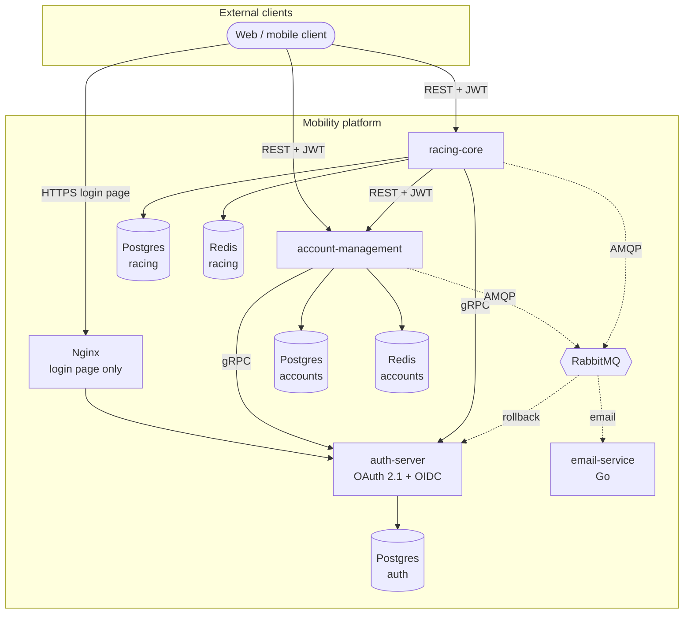

# Architecture

This document describes the Mobility Systems architecture.
It's describing in detail what each service owns, how they communicate and where are the boundaries.

## System context

This platform is a demo application. Users can register as either individuals or members of an organization. Also a flow for registering an organization can be used. A subset of users can additionally take
on the role of driver, which unlocks domain features around cars, laps, and tracks. All authentication and authorization flows through a dedicated OAuth 2.1 authorization server.

## Container diagram

Solid arrows are synchronous (HTTP, gRPC). Dashed arrows are asynchronous (AMQP).

## Service responsibilities

### **auth-server**

The single source of truth for authentication and authorization across the
platform. Built on **Spring Authorization Server**.

**Exposes:**

- **OAuth 2.1 endpoints** (HTTPS via Nginx) for external clients: authorization
  endpoint with PKCE, token endpoint, JWKS endpoint, OIDC discovery.
- **gRPC services** (internal only) for user creation, role changes, and credential
  operations called by other services during saga execution.
- **RabbitMQ listeners** for saga compensation events. When an orchestrating
  service's saga fails after calling auth-server, it publishes a rollback event
  and auth-server consumes it to undo its local changes.

**Owns:**

- User identities, credentials, and role assignments.
- OAuth client registrations.
- JWT signing keys.

**Does not know about:** the domain (cars, drivers, organizations, profiles).
It only cares about identity and access.

### **account-management**

Handles the public-facing registration flow for both individual users and
organizations, plus ongoing account lifecycle (profile updates, confirmation
tokens, etc.).

**Exposes:** REST endpoints only. External clients and internal callers
(racing-core) both hit the same REST surface, authenticated as an OAuth 2.1
resource server that validates JWTs issued by auth-server. It is not a gRPC server.

**Owns:** user profile data, organization data, registration state, confirmation
tokens, pending-registration records.

**Depends on:**

- auth-server via gRPC for identity creation and credential changes.
- RabbitMQ for publishing email events and rollback events.
- PostgreSQL for persistence, Redis for cache.

### **racing-core**

The domain service. Cars, tracks, laps, drivers, lap times. Through this service the
user can register as a driver which uses the orhictration saga pattern because it must update the user's
role set in auth-server.

**Exposes:** REST endpoints, authenticated as an OAuth 2.1 resource server.

**Owns:** all racing-domain data.

**Depends on:** 
- auth-server via gRPC for role changes (saga step in driver registration).
- account-management via REST for user/profile lookups it can't serve locally,
  using a Client Credentials JWT for authentication.
- RabbitMQ for publishing email events and rollback events.
- PostgreSQL for persistence, Redis for cache.

### **email-service**

A deliberately small Go service that listens on an email queue and delivers
transactional emails via the Resend API. It holds no database and no cache —
if the process restarts, RabbitMQ's delivery guarantees ensure nothing is lost.

The language choice (Go rather than Java) is intentional — it exercises the
platform's polyglot message contracts and demonstrates that service boundaries
really are decoupled by the message bus.

## Communication patterns

The platform uses three communication patterns, each chosen for specific properties:

### • External HTTP (REST)

External clients interact with the platform over HTTPS. Account-management and
racing-core expose REST endpoints directly; external clients call them as
OAuth 2.1 resource servers and attach a JWT access token on every request.
The token is validated locally using the auth-server's published JWKS — no
round-trip to auth-server is required per request.

OpenAPI/Swagger documentation is generated automatically via springdoc-openapi
and served by each resource server.

**Why REST externally:** broad client support, cacheable, debuggable, and the
standard OAuth 2.1 flows are defined over HTTP.

### • Internal REST
 
Racing-core calls account-management over **REST**, authenticating with a Client Credentials JWT issued by the
auth-server -the same token flow that external clients use- and the same
flow racing-core uses for its gRPC calls to auth-server. The transport
differs but the authentication model does not.

### •  Internal gRPC

Service-to-service synchronous calls use gRPC with mTLS-friendly transport and
protobuf contracts. Access tokens travel in call metadata via an interceptor;
services authenticate to auth-server using the OAuth 2.1 Client Credentials
grant.

**Why gRPC internally:** typed contracts that fail fast at compile time,
lower latency, smaller payloads, streaming support if needed later. The
protobuf definitions live in `mobility-common` so all services share one
canonical contract.

### • Asynchronous messaging (RabbitMQ)

RabbitMQ carries two distinct classes of messages:

1. **Email events**: emails consumed by email-service.
2. **Rollback events**: saga compensation signals consumed by auth-server when
   a remote orchestrator's saga fails after invoking it.

**Why RabbitMQ:** decouples the orchestrator from the compensator. The
orchestrating service doesn't need auth-server to be reachable at rollback
time. RabbitMQ queues the event and auth-server processes it when it can.
This is more resilient than trying to call a compensation gRPC method
synchronously while the system is already in a failure path.

Queue names and exchange bindings live in `mobility-common` so publishers
and consumers have a single point of truth.

## Data ownership

Each service that persists state owns its own PostgreSQL database. There is no
shared schema and no cross-service SQL. If service A needs data owned by service
B, it calls B via gRPC or waits for an event from B.

Redis is wired through the **Spring Cache abstraction** (`@Cacheable`,
`@CacheEvict`) rather than accessed as a raw client. Cache regions are
service-local so each service decides which queries and derived data are
worth caching.

**Why database per service:** independent evolution of schemas, independent
scaling of database resources, and a hard enforcement of service boundaries
at the data layer (not just at the code layer).

## Security model

- **External clients** authenticate via OAuth 2.1 Authorization Code + PKCE and
  receive JWT access tokens.
- **Internal services** authenticate to auth-server via OAuth 2.1 Client
  Credentials and receive their own JWT access tokens.
- **Resource servers** (account-management, racing-core) validate JWTs
  statelessly using the auth-server's public keys served from the JWKS
  endpoint. No call to auth-server is required per request.
- **Access tokens are short-lived** refresh tokens handle long sessions for
  external clients.
- **Role-based authorization** is enforced at the resource server level using
  claims embedded in the JWT by auth-server.

### Confirmation tokens

A separate class of token exists for account confirmation. When a user
registers, account-management emails them a link containing a JWT-based
confirmation token. The token is signed (so it can be validated statelessly)
*and* tracked by a database row (so it can be marked single-use after
redemption). This is a hybrid design leveraging strengths of both stateless and statefull architectures.

## Shared code

The `mobility-common` library is a multi-module Maven project consumed by all
three Java services:

- **`proto-common`**: gRPC `.proto` files and generated Java sources. One
  contract shared by clients and server guarantees compatibility.
- **`rabbitmq-common`**: exchange names, queue names, routing keys, and
  message DTOs. Ensures publishers and consumers agree.
- **`infrastructure-common`**: cross-cutting primitives: the `SagaOrchestrator`,
  `SagaAction` functional interface, common exceptions, the
  `MobilityAppErrorResponse` shape returned by all services on error,
  `SearchResponse<T>` for paginated endpoints, Utils like the ULID generator and
  shared enums.

## Distributed transactions

Any workflow that touches multiple services is implemented as a saga with
explicit compensating actions rather than a distributed transaction. Two of these sagas live in the platform today: user registration (account-management) and driver registration (racing-core). Both are
documented in detail with sequence diagrams in [sagas.md](./sagas.md).