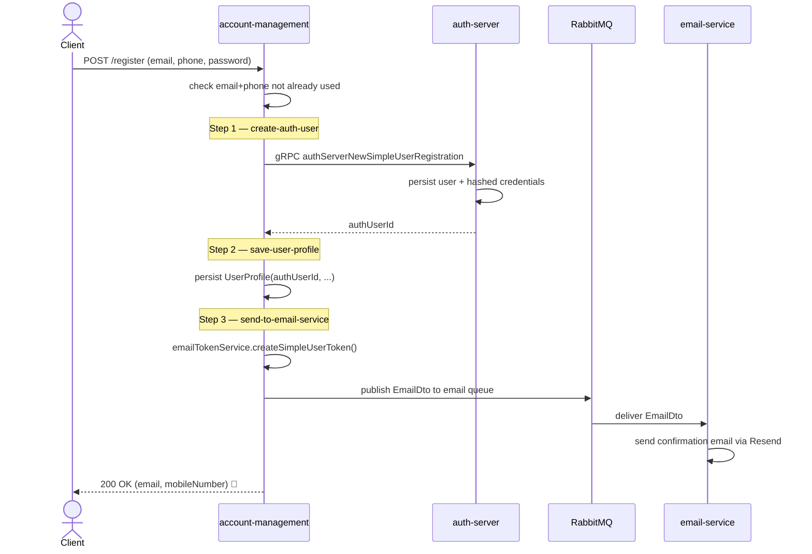
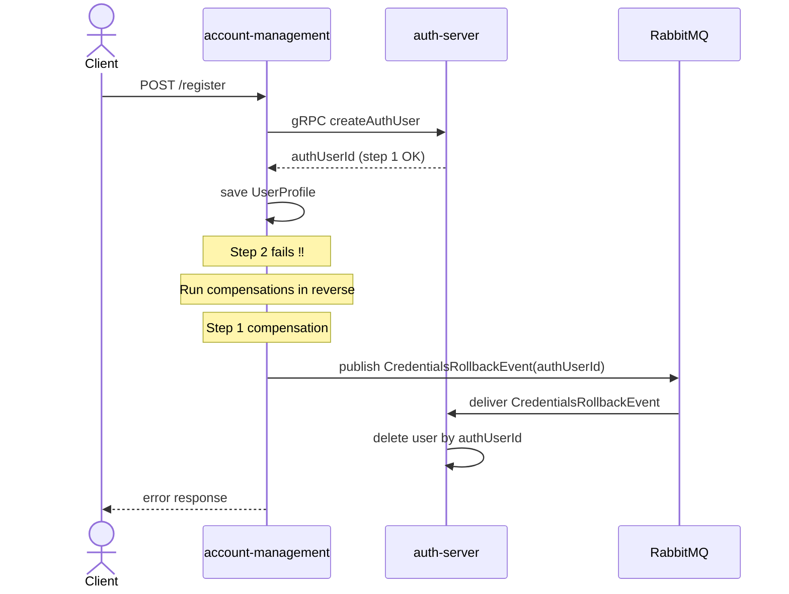
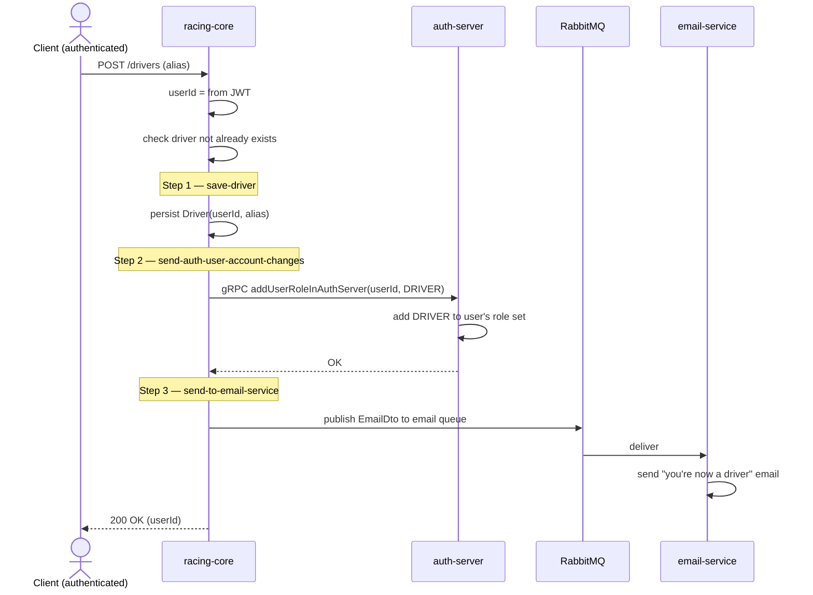
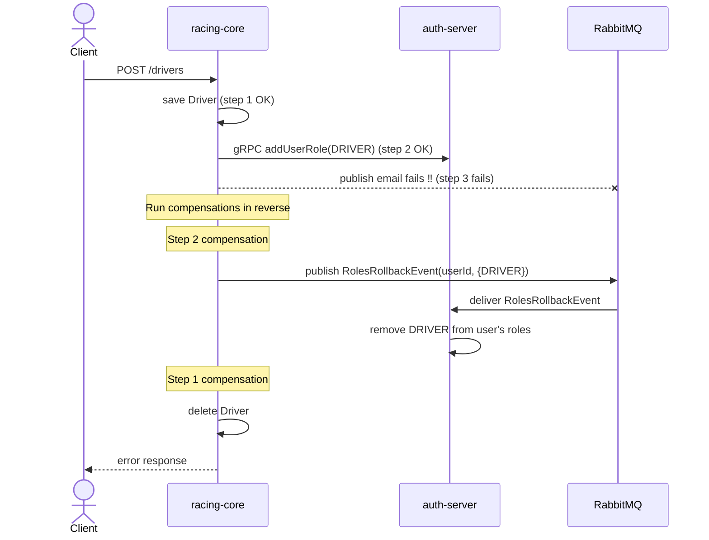

# Saga flows

The platform has two distributed workflows that span multiple services. Both are
implemented as **orchestrated sagas** with explicit compensating actions. One
orchestrator service executes a sequence of steps, and if any step fails, the
orchestrator runs the compensations for the previously-succeeded steps in
reverse order.

Both sagas use the `SagaOrchestrator` from `mobility-common/infrastructure-common`.

## Below are example of saga orchatrations

## Saga 1 - User registration

Orchestrated by **account-management** when a new user signs up.

### Steps

| # | Name | Action | Compensation |
|---|---|---|---|
| 1 | `create-auth-user` | gRPC call to auth-server to create identity + credentials. Stores returned `authUserId` in saga context. | Publish `CredentialsRollbackEvent` to RabbitMQ. Auth-server consumes it and deletes the user. |
| 2 | `save-user-profile` | Persist `UserProfile` locally in account-management's database, linked by `authUserId`. | Delete the profile row. |
| 3 | `send-to-email-service` | Generate confirmation token, build confirmation link, publish email event to RabbitMQ. | No compensation. |

### Order reasoning

The remote work (creating the auth identity) runs **first** because
account-management needs the generated `authUserId` as a foreign key on its
local profile row. Doing the local work first and then discovering auth-server
rejected the request would mean a compensation on every validation failure.
Doing remote first means validation failures return cleanly before any local
state exists.

### Sequence diagram (happy path)

The confirmation token generated in step 3 is a hybrid JWT + database row
design. Stateless validation and single-use enforcement.

### Sequence diagram (failure + compensation)

Scenario: step 1 succeeds, step 2 fails (e.g. a unique constraint violation
on a field other than email). The orchestrator runs step 1 compensation.

### Why publish rollback over RabbitMQ instead of calling gRPC to compensate?

A compensating gRPC call to auth-server would require auth-server to be
reachable in the middle of what is already a failure path. If auth-server is
slow or temporarily unavailable, the compensation fails and the system is left
inconsistent. By publishing the rollback to RabbitMQ, the orchestrator's
saga completes immediately and the broker guarantees eventual delivery, and
auth-server consumes and applies the compensation when it can.

---

## Saga 2 - Driver registration

Orchestrated by **racing-core** when an authenticated user opts in to the
driver role.

### Steps

| # | Name | Action | Compensation |
|---|---|---|---|
| 1 | `save-driver` | Persist `Driver(id = userId, alias)` locally in racing-core's database. | Delete the driver row. |
| 2 | `send-auth-user-account-changes` | gRPC call to auth-server to add the `DRIVER` role to the user's role set. | Publish `RolesRollbackEvent` to RabbitMQ. Auth-server consumes it and removes the `DRIVER` role. |
| 3 | `send-to-email-service` | Publish confirmation email event to RabbitMQ. | No compensation. |

### Why this order differs from saga 1

Racing-core **already has the user ID** from the JWT of the incoming request.
It does not need auth-server to generate one, so the local work can happen
first. This flips the ordering compared to user registration and lets racing-core
reject duplicate-alias requests without ever touching auth-server.

This is a small but telling design point. Saga step ordering is driven by
**data dependencies**, not a rigid template.

### Sequence diagram (happy path)

### Sequence diagram (failure + compensation)

Scenario: step 1 and step 2 succeed. Step 3 fails (e.g., RabbitMQ is briefly
unreachable). Compensations run for step 2 and step 1 in reverse order.

